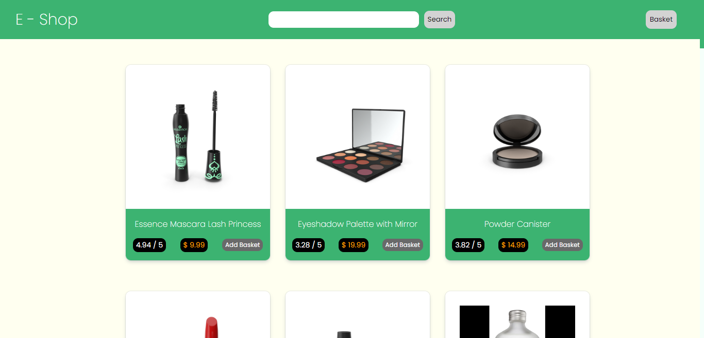
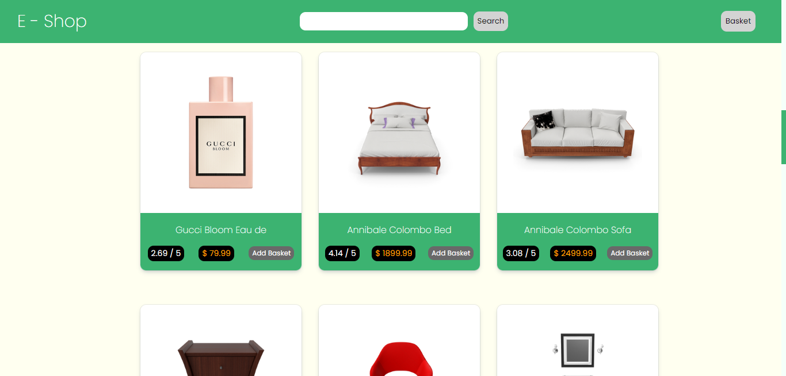
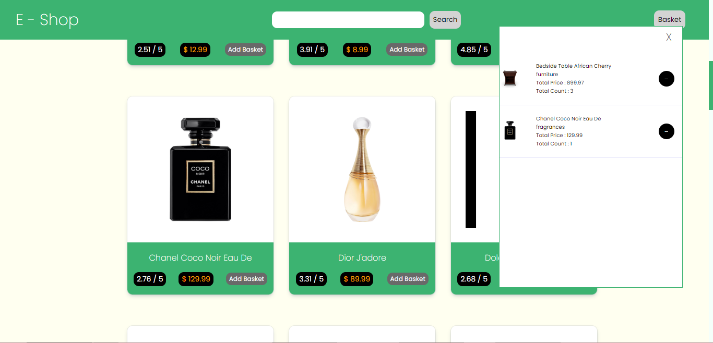
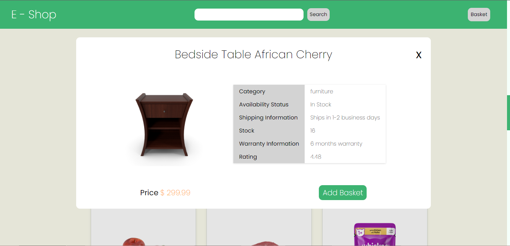
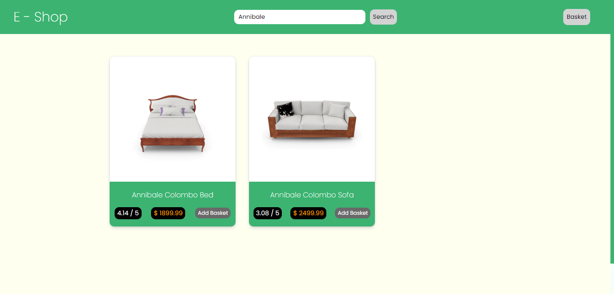

# E-Shop - E - Commerce App - jQuery

  

## About

This is an Simple E-Commerce App. You can see details about the products and add to basket.

## Development

This project's backend was developed with only jQuery and the frontend was developed with HTML5 + CSS3

Your chosen products will be saved in localStorage

DummyJSON API is used as a dummy data

## Gallery

##

##

##

##

